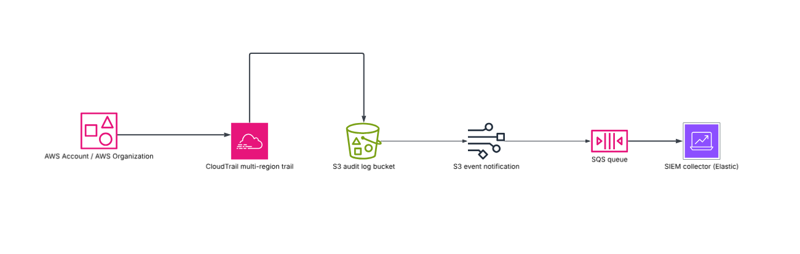
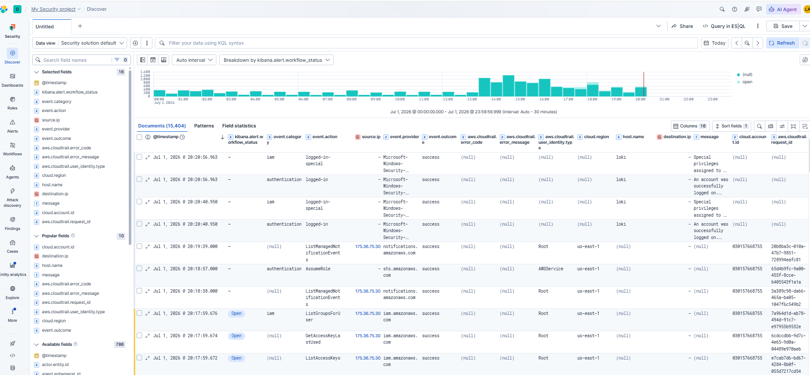

# CloudTrail Elastic Detection Pipeline

## Project Summary

This project demonstrates an AWS security monitoring pipeline that collects AWS CloudTrail activity into Elastic Security and uses custom detection rules to identify suspicious or high-risk cloud activity.

The project focuses on practical cloud security monitoring for AWS account activity, IAM activity, S3 security changes, console authentication events, and CloudTrail tampering.

## Project Objectives

- Collect AWS CloudTrail events into Elastic.
- Create custom Elastic Security detection rules for common AWS attack and misconfiguration scenarios.
- Test each detection rule by generating safe AWS activity in a lab account.
- Document the detection logic, expected CloudTrail events, evidence, and response steps.
- Build a portfolio-ready cloud security monitoring project.

## Architecture Overview

```text
AWS Account
  |
  | CloudTrail management and data events
  v
CloudTrail Trail
  |
  | Logs delivered to S3
  v
S3 CloudTrail Log Bucket
  |
  | SQS notification / Elastic AWS integration
  v
Elastic Agent / AWS Integration
  |
  v
Elastic Data Stream: aws.cloudtrail
  |
  v
Elastic Security Detection Rules
  |
  v
Security Alerts and Investigation Workflow
```


## Data Source

| Source | Description |
|---|---|
| AWS CloudTrail | Records AWS API activity, console logins, IAM changes, S3 configuration changes, and CloudTrail configuration changes. |
| Elastic AWS Integration | Ingests CloudTrail logs into Elastic. |
| Elastic Security | Runs custom detection rules and generates security alerts. |

## Detection Rules Created

| # | Rule Name | Severity | Risk Score | Purpose |
|---|---|---:|---:|---|
| 1 | AWS CloudTrail Logging Disabled or Modified | High | 73 | Detects attempts to modify, disable, or delete CloudTrail logging. |
| 2 | AccessDenied Spike by Same Identity | Medium | 66 | Detects repeated denied AWS API calls from the same identity. |
| 3 | AWS API AccessDenied Activity | Medium | 43 | Detects AWS API calls that fail because of permission issues. |
| 4 | Root Account Activity | High | 83 | Detects activity performed by the AWS root account. |
| 5 | AWS Console Login Failure | Medium | 31 | Detects failed AWS console login attempts. |
| 6 | Console Login Without MFA | Critical | 99 | Detects successful console login where MFA was not used. |
| 7 | IAM Access Key Updated or Deleted | Medium | 47 | Detects IAM access key update or deletion activity. |
| 8 | S3 Bucket Versioning Changed | Medium | 61 | Detects changes to S3 bucket versioning. |

## Repository Structure

```text
cloudtrail-elastic-detection-pipeline/
├── README.md
├── screenshots/
│   ├── rules-enabled.png
│   ├── discover-cloudtrail-events.png
│   ├── alert-accessdenied.png
│   ├── alert-console-login-failure.png
│   ├── alert-s3-public-access.png
│   └── alert-versioning-changed.png
|   └── more....
├── detections/
│   ├── aws_api_access_denied.md
│   ├── access_denied_spike.md
│   ├── cloudtrail_logging_modified.md
│   ├── root_account_activity.md
│   ├── console_login_failure.md
│   ├── console_login_without_mfa.md
│   ├── iam_access_key_updated_or_deleted.md
│   └── s3_bucket_versioning_changed.md
├── test-evidence/
    └── test-results.md

```

## Useful Elastic Discover Query

```kql
data_stream.dataset:"aws.cloudtrail"
```

Useful fields to added in Discover:

```text
@timestamp
event.action
event.provider
event.outcome
cloud.account.id
cloud.region
user.name
source.ip
user_agent.original
aws.cloudtrail.user_identity.type
aws.cloudtrail.user_identity.arn
aws.cloudtrail.error_code
aws.cloudtrail.error_message
aws.cloudtrail.request_parameters
```
## Elastic Security Dashboard



## Testing Methodology

Each rule was tested using controlled AWS actions in a lab AWS account.

Testing process:

1. Confirm CloudTrail is enabled and delivering logs.
2. Confirm Elastic is receiving `aws.cloudtrail` events.
3. Run a safe AWS test action that should match the rule logic.
4. Search for the event in Elastic Discover.
5. Confirm that the Elastic Security rule generated an alert.
6. Capture screenshots of the raw event, generated alert, and rule status.
7. Clean up temporary AWS resources.


## Project Outcome

The project successfully demonstrates how AWS CloudTrail events can be collected, monitored, and converted into actionable security alerts using Elastic Security. The detections cover common cloud security scenarios such as unauthorized access attempts, root account usage, console authentication issues, S3 exposure risks, IAM key changes, and CloudTrail tampering.

```
## Limitations

- Detection accuracy depends on CloudTrail coverage and Elastic ingestion health.
- Some rules may require tuning to reduce false positives.
- Lab testing was performed in a controlled environment and may need adjustment for production.
- Field names may vary depending on Elastic integration version and AWS integration configuration.
- Some actions may take several minutes to appear in Elastic because CloudTrail delivery is not instant.

```
## Future Improvements

- Add EventBridge or SNS alerting for critical detections.
- Add Slack, email, or ticketing integration for high severity alerts.
- Add automated response actions for confirmed incidents.
- Add GuardDuty and Security Hub findings into Elastic.
- Add AWS Config rules for configuration compliance.
- Add dashboards for AWS security monitoring.
- Add Terraform code for repeatable deployment.


