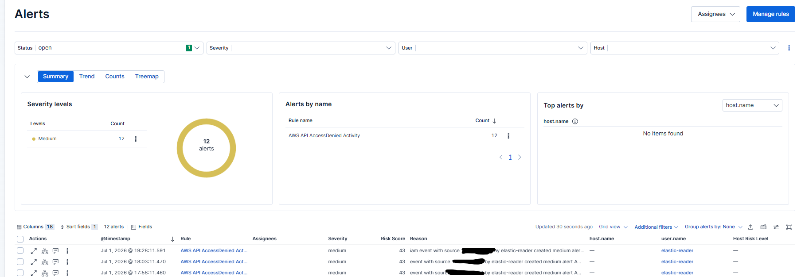

# AWS API AccessDenied Activity

Detects AWS API calls that fail because the caller does not have permission.

## 1. Rule Details

```text
Rule Name: AWS API AccessDenied Activity
Severity: Medium
Risk Score: 43
Data Source: AWS CloudTrail
Elastic Dataset: aws.cloudtrail
Status: Enabled
```

## 2. Detection Logic

```kql
data_stream.dataset:"aws.cloudtrail" and aws.cloudtrail.error_code:*AccessDenied*
```

## 3. CloudTrail Events

```text
AccessDenied, AccessDeniedException, UnauthorizedOperation
```

## 4. Why This Matters

Unauthorized probing, privilege testing, broken automation, or misconfigured IAM permissions.

## 5. Test Procedure

Run a command with a limited-permission IAM user, such as `aws iam list-users --profile denied-test`.

## 6. Expected Result

The AWS action should appear in Elastic Discover under:

```kql
data_stream.dataset:"aws.cloudtrail"
```

The rule should generate an Elastic Security alert for:

```text
AWS API AccessDenied Activity
```

## 7. Evidence

Add screenshots after testing.



## 8. Fields to Review

```text
@timestamp
event.action
event.provider
event.outcome
cloud.account.id
cloud.region
source.ip
user_agent.original
aws.cloudtrail.user_identity.type
aws.cloudtrail.user_identity.arn
aws.cloudtrail.error_code
aws.cloudtrail.error_message
aws.cloudtrail.request_parameters
```

## 9. False Positives

Common false positives include:

1. Approved administrator activity.
2. Lab testing.
3. Terraform or CloudFormation changes.
4. Developer permission testing.
5. Misconfigured applications or automation.

## 10. Investigation Steps

1. Identify the AWS identity involved.
2. Review the event action and AWS service.
3. Check the source IP address.
4. Check the user agent.
5. Confirm whether the action was approved.
6. Search for related activity from the same identity.
7. Check whether any sensitive services were accessed.

## 11. Response Actions

1. Confirm whether the activity was legitimate.
2. If suspicious, disable or rotate affected credentials.
3. Review IAM permissions.
4. Search for other CloudTrail events from the same identity.
5. Preserve screenshots and evidence.
6. Escalate if the activity involved root, IAM, S3, CloudTrail, KMS, or Organizations.


