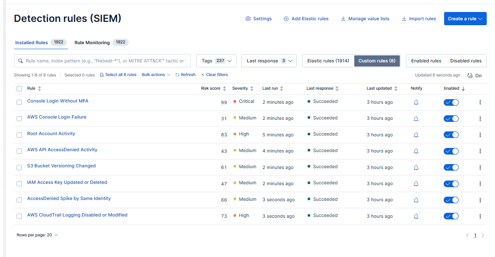
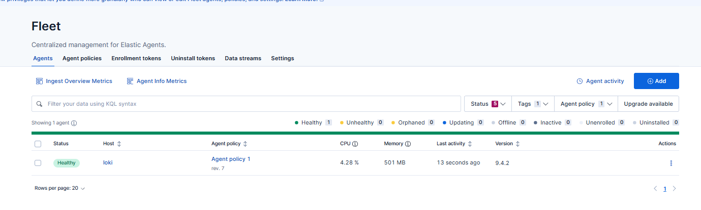
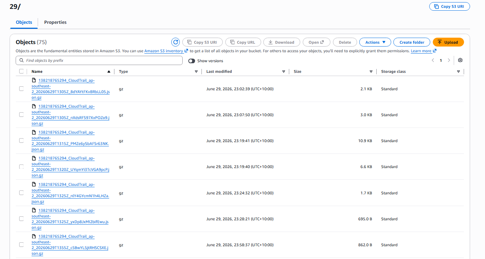
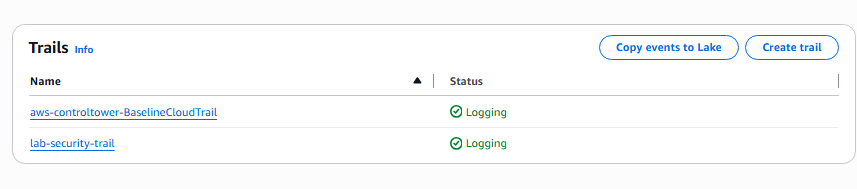
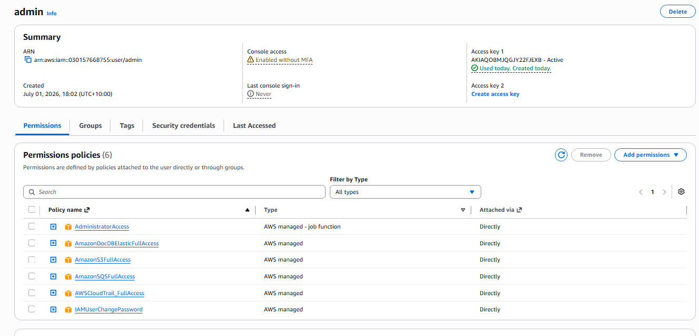
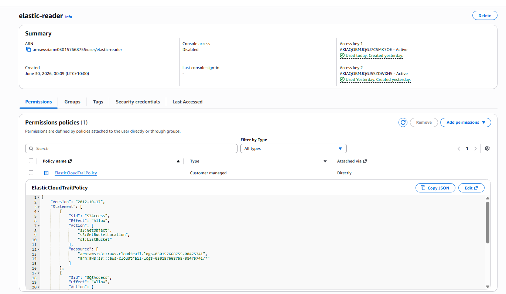

# Test Results

This file records the testing evidence for the CloudTrail to Elastic detection pipeline.

## 1. Test Environment

```text
Project: CloudTrail to Elastic Detection Pipeline
AWS Region: ap-southeast-2
Elastic Dataset: aws.cloudtrail
CloudTrail Source: S3 bucket with .gz CloudTrail logs
Ingestion Method: Elastic AWS integration using S3/SQS
Tester: To update
Test Date: To update
AWS Account ID: To update
```

## 2. Main Elastic Query

```kql
data_stream.dataset:"aws.cloudtrail"
```

## 3. Test Summary

## 3. Test Summary

| # | Rule | Test Action | Expected Event | Alert Result |
|---|---|---|---|---|
| 1 | AWS CloudTrail Logging Disabled or Modified | Update or stop/start CloudTrail | UpdateTrail / StopLogging | Alert generated successfully |
| 2 | AccessDenied Spike by Same Identity | Run repeated denied API calls | AccessDenied | Alert generated after threshold reached |
| 3 | AWS API AccessDenied Activity | Run one denied API call | AccessDenied | Alert generated successfully |
| 4 | Root Account Activity | Sign in as root | ConsoleLogin / Root | High severity alert generated |
| 5 | AWS Console Login Failure | Attempt wrong password | ConsoleLogin Failure | Alert generated successfully |
| 6 | Console Login Without MFA | Login without MFA | ConsoleLogin / MFAUsed No | Critical alert generated |
| 7 | IAM Access Key Updated or Deleted | Disable or delete test key | UpdateAccessKey / DeleteAccessKey | Alert generated successfully |
| 8 | S3 Bucket Versioning Changed | Enable or suspend versioning | PutBucketVersioning | Alert generated successfully |
## 4. Evidence Screenshots














## 5. Final Result

```text
All 8 AWS CloudTrail detection rules were created and enabled in Elastic Security.

CloudTrail logs were successfully ingested into Elastic using the AWS integration.

Test events were generated in the AWS lab account and reviewed in Elastic Discover.

Alerts were generated successfully for the tested detection scenarios.

```
